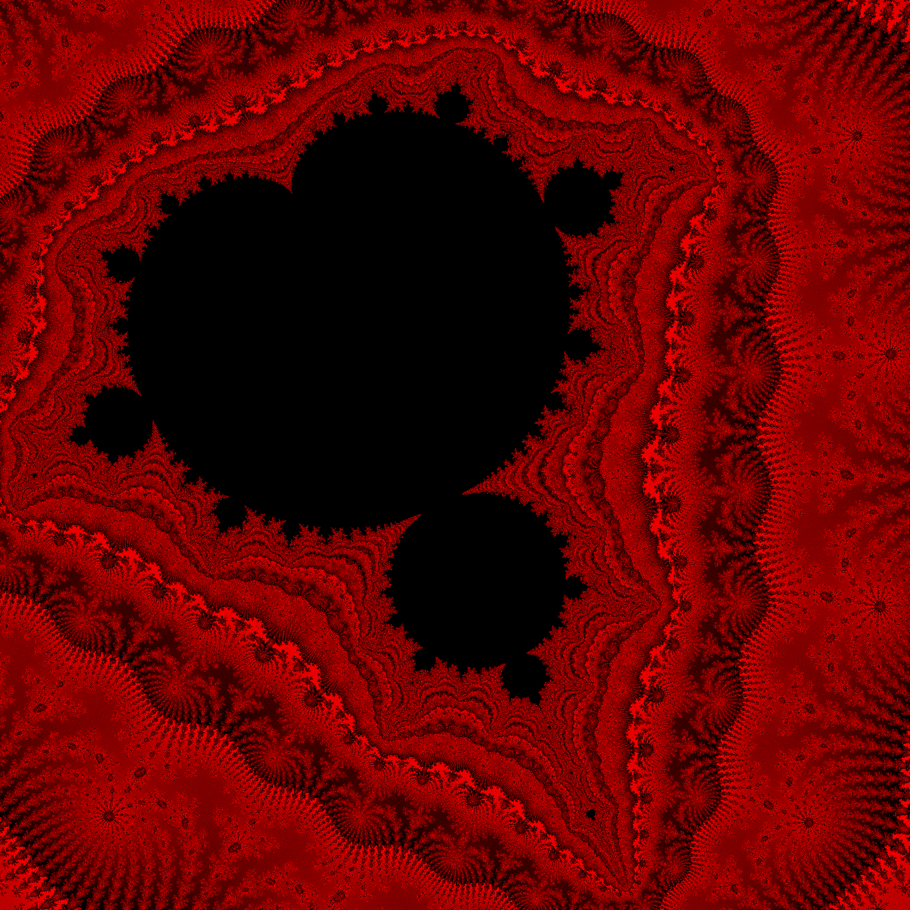
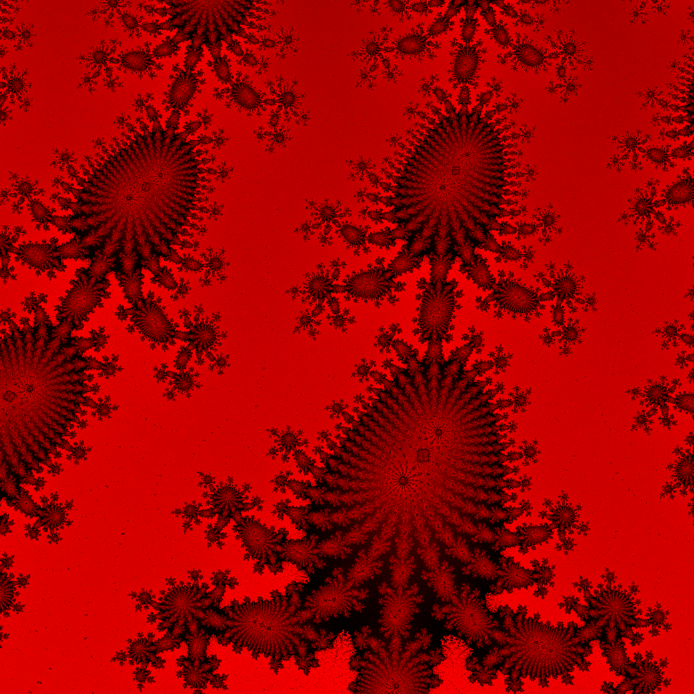

# brotsycl

brotsycl is a Mandelbrot set image generator, for scientists and artists. Leveraging the SYCL language, it can be run
on CPUs and GPUs, allowing for very fast computation.

## Usage

The executable is to be run from the command line. You'll need to provide the coordinates of the bottom-left pixel, the size in the vertical axis, the size of the generated image in pixels and the max number of iterations. There are also some options, for example to force cpu usage.

This is an example command:
```bash
./brotsycl -2 -2 4 1024 1024 1000
```
It produces a square 1024x1024 image with (-2, -2) bottom-left, and (2, 2) upper-right pixels.

After doing the heavy calculations, a buffer file is created. It can be fed to the program with -i to skip the computation phase.

There is an almost-all-architectures executable in [releases](https://github.com/silimotion/brotsycl/releases/latest). It has been tested and worked on AMD HIP GPU systems, and CPUs. Work is ongoing to add support to other architectures. It may or may not work on OpenCL devices. If the executable does not work on one of the supported systems please raise an issue. For more information on support, view [#Limitations](#limitations).

## Building

You first need a SYCL compiler, such as [AdaptiveCpp](https://github.com/AdaptiveCpp/AdaptiveCpp) or DPC++. If you wish to have gpu acceleration, 
you'll need the appropiate drivers installed, and compile with a capable compiler.

Once you have a functional installation you can compile the project. If using the OpenSYCL compiler, you may compile using the following command:
```bash
acpp --opensycl-targets="omp;generic" -Ofast -flto -o brotsycl main.cpp 
```
## Examples and Gallery

```bash
./brotsycl -0.71580045904 0.284632300657 0.000000000143 2048 2048 300000 --exp 0.7
```


Example usage of -i and --buf options:

```bash
#First create an image, saving it using --buf:
./brotsycl -0.652 0.479 0.001 4096 4096 10000 --buf buffer.buf
```


```bash
#Now we use the previous buffer to create a new image without needing to calculate again:
./brotsycl -i buffer.buf --exp 0.7 --bg 200 200 200 -o end_result.ppm
```


Another example of different results using --exp:

```bash
./brotsycl -0.71580045904 0.284632300943 0.000000000143 2048 2048 300000
```


```bash
./brotsycl -0.71580045904 0.284632300943 0.000000000143 2048 2048 300000 --exp 0.7
```


## Benchmarks

These benchmarks were measured using the 'time' utility ("user" tab), and compiling with the OpenSYCL compiler

| Device                 | Image 1      | Image 2      |
|------------------------|--------------|--------------|
|  AMD 7600 CPU (OpenMP) | 14m 16.409s  |     57.380s  |
|  AMD 6600 GPU          |      9.906s  |      1.269s  |
|  AMD 7600 iGPU         |  2m 34.451s  |      9.509s  |
|  AMD 5600H iGPU        |     56.970s  |      3.901s  |

## Limitations

Due to the very early stage of SYCL compilers, it is hard to get a generic SYCL executable. Work is being done by the AdaptiveCpp team to 
develop the SSCP generic compilation. Until everything is polished enough, it will be difficult to produce a tiny and performant downloadable executable runnable on all architectures.

Using the GPU that runs the displays for the calculations may cause freezing. I am investigating this to clarify whether it is a bug in SYCL, the compiler, the program, or intended behaviour.

When running on OpenMP some cores may not be used. I am investigating this also.

The precision of the floats is double, as 128 bit floats are not supported in many GPUs, and will run **very** slowly in 64-bit CPUs. This shouldn't be a limitation in all but the most extreme cases. An example of this can be seen with the image obteined by running the following command: 
```bash
./brotsycl -0.71580045904 -0.2846323008 0.0000000000000143 2048 2048 300000 --gpu --exp 0.7
```
(Guess we'll have to wait till the 128 bit era)

## License

This repository is licensed under the [MIT license](LICENSE.md)
